<picture><source media="(max-width: 600px)" srcset="assets/hero-mobile.svg"></picture>

<a href="https://angel-arista-villanueva.lovable.app"><picture><source media="(max-width: 600px) and (prefers-color-scheme: dark)" srcset="assets/btn-portfolio-mobile-dark.svg"><source media="(max-width: 600px)" srcset="assets/btn-portfolio-mobile-light.svg"><source media="(prefers-color-scheme: dark)" srcset="assets/btn-portfolio-dark.svg"></picture></a>
<a href="mailto:angelalberto077@gmail.com"><picture><source media="(max-width: 600px) and (prefers-color-scheme: dark)" srcset="assets/btn-contact-mobile-dark.svg"><source media="(max-width: 600px)" srcset="assets/btn-contact-mobile-light.svg"><source media="(prefers-color-scheme: dark)" srcset="assets/btn-contact-dark.svg"></picture></a>

<a href="https://www.linkedin.com/in/angel-alberto-arista-villanueva-617432208/"><picture><source media="(max-width: 600px) and (prefers-color-scheme: dark)" srcset="assets/ic-linkedin-mobile-dark.svg"><source media="(max-width: 600px)" srcset="assets/ic-linkedin-mobile-light.svg"><source media="(prefers-color-scheme: dark)" srcset="assets/ic-linkedin-dark.svg"></picture></a>
<a href="https://wa.me/525625660729"><picture><source media="(max-width: 600px) and (prefers-color-scheme: dark)" srcset="assets/ic-whatsapp-mobile-dark.svg"><source media="(max-width: 600px)" srcset="assets/ic-whatsapp-mobile-light.svg"><source media="(prefers-color-scheme: dark)" srcset="assets/ic-whatsapp-dark.svg"></picture></a>
<a href="mailto:angelalberto077@gmail.com"><picture><source media="(max-width: 600px) and (prefers-color-scheme: dark)" srcset="assets/ic-email-mobile-dark.svg"><source media="(max-width: 600px)" srcset="assets/ic-email-mobile-light.svg"><source media="(prefers-color-scheme: dark)" srcset="assets/ic-email-dark.svg"></picture></a>
<a href="https://github.com/angelalberto0775859?tab=repositories"><picture><source media="(max-width: 600px) and (prefers-color-scheme: dark)" srcset="assets/ic-github-mobile-dark.svg"><source media="(max-width: 600px)" srcset="assets/ic-github-mobile-light.svg"><source media="(prefers-color-scheme: dark)" srcset="assets/ic-github-dark.svg"></picture></a>

 

<picture><source media="(max-width: 600px) and (prefers-color-scheme: dark)" srcset="assets/band-about-mobile-dark.svg"><source media="(max-width: 600px)" srcset="assets/band-about-mobile-light.svg"><source media="(prefers-color-scheme: dark)" srcset="assets/band-about-dark.svg"></picture>

I'm an engineer in Digital Animation and Video Games with a specialty in Graphic Simulation, based in Mexico City. My work sits between web development, brand identity and audiovisual production — I turn ideas into digital experiences with a clear intent behind them.

A project might start with a brand looking for its visual language, a site that needs to explain a service better, or a piece of video that has to earn someone's attention. I stay involved from concept to execution, connecting the creative side with the technology and with what the results actually say.

This profile is the code side of that work. My [portfolio](https://angel-arista-villanueva.lovable.app) covers the rest: branding, animation, content and audiovisual production.

<picture><source media="(max-width: 600px) and (prefers-color-scheme: dark)" srcset="assets/band-work-mobile-dark.svg"><source media="(max-width: 600px)" srcset="assets/band-work-mobile-light.svg"><source media="(prefers-color-scheme: dark)" srcset="assets/band-work-dark.svg"></picture>

**[QuiénOpina](https://quienopina.mx)** — Visual identity, editorial design system and content strategy for a social intelligence platform that reads trends and public opinion with AI. My part connects the data to a visual language people can actually follow.

**[Vexel Digital](https://vexel.digital)** — Creative direction and development. I collaborate on web development, branding and audiovisual production for clients across different industries.

**[Geriactive](https://geriactive.mx)** — Design and development of a site for a therapy center specialized in older adults, built around accessibility and clarity of information.

**[SecretBloom](https://eflora.lovable.app)** — Design and development of an online store for a flower shop, with a warm aesthetic and a shopping experience made for browsing and ordering easily.

**[Dr. Juan Carlos Arista](https://cuidadodeldolor.lovable.app)** — Design and development of a medical platform for pain medicine and palliative care, including patient management, appointments and administrative follow-up.

<b>More identity and production work</b>

 

**Congreso Nacional de Marketing** — Visual identity and stage production for the artificial intelligence track.

**Statega** — Corporate identity for a digital strategy agency, with an icon that communicates speed, direction and technology.

**GSI Seguridad Privada** — Campaign pieces built around trust and visual consistency across formats.

**AX Transporter** — Campaign visual system for a tourist transfer brand, focused on comfort, exclusivity and destinations.

[See the full cases in my portfolio →](https://angel-arista-villanueva.lovable.app/#proyectos)

<picture><source media="(max-width: 600px) and (prefers-color-scheme: dark)" srcset="assets/band-toolkit-mobile-dark.svg"><source media="(max-width: 600px)" srcset="assets/band-toolkit-mobile-light.svg"><source media="(prefers-color-scheme: dark)" srcset="assets/band-toolkit-dark.svg"></picture>

**Web development** — React, TypeScript and HTML for sites, interfaces and digital platforms. Figma for interface and experience design. VS Code, Codex and Claude as everyday working tools.

<picture><source media="(max-width: 600px) and (prefers-color-scheme: dark)" srcset="assets/chips-web-mobile-dark.svg"><source media="(max-width: 600px)" srcset="assets/chips-web-mobile-light.svg"><source media="(prefers-color-scheme: dark)" srcset="assets/chips-web-dark.svg"></picture>

**Design, animation and production** — Blender for 3D modeling and simulation. After Effects and Premiere Pro for motion graphics and editing. Illustrator, Photoshop and Affinity for visual identity and graphic pieces. Particle simulation, visual effects and digital animation, with an engineering foundation underneath.

<picture><source media="(max-width: 600px) and (prefers-color-scheme: dark)" srcset="assets/chips-design-mobile-dark.svg"><source media="(max-width: 600px)" srcset="assets/chips-design-mobile-light.svg"><source media="(prefers-color-scheme: dark)" srcset="assets/chips-design-dark.svg"></picture>

**Marketing, content and AI** — Meta Ads, Google Ads and Google Analytics for campaigns and performance analysis. Content strategy, editorial calendars and community management. AI applied to creative processes and visual content.

<picture><source media="(max-width: 600px) and (prefers-color-scheme: dark)" srcset="assets/chips-marketing-mobile-dark.svg"><source media="(max-width: 600px)" srcset="assets/chips-marketing-mobile-light.svg"><source media="(prefers-color-scheme: dark)" srcset="assets/chips-marketing-dark.svg"></picture>

<picture><source media="(max-width: 600px) and (prefers-color-scheme: dark)" srcset="assets/band-repos-mobile-dark.svg"><source media="(max-width: 600px)" srcset="assets/band-repos-mobile-light.svg"><source media="(prefers-color-scheme: dark)" srcset="assets/band-repos-dark.svg"></picture>

| Repository | Stack | Notes |
| :--- | :--- | :--- |
| [Central-de-Alarmas](https://github.com/angelalberto0775859/Central-de-Alarmas) | HTML | Live at [centraldealarmas.website](https://centraldealarmas.website) |
| [gsi-seguridad-privada](https://github.com/angelalberto0775859/gsi-seguridad-privada) | TypeScript | Site for a private security company |
| [export-elementor-pro-json](https://github.com/angelalberto0775859/export-elementor-pro-json) | Python | Agent skill that generates and validates importable Elementor Pro JSON templates |
| [publicaciones](https://github.com/angelalberto0775859/publicaciones) | TypeScript | Social content and campaign pieces |
| [Paginasweb](https://github.com/angelalberto0775859/Paginasweb) | Web | Web page editing and front-end work |

[Browse all repositories →](https://github.com/angelalberto0775859?tab=repositories)

<picture><source media="(max-width: 600px) and (prefers-color-scheme: dark)" srcset="assets/band-contact-mobile-dark.svg"><source media="(max-width: 600px)" srcset="assets/band-contact-mobile-light.svg"><source media="(prefers-color-scheme: dark)" srcset="assets/band-contact-dark.svg"></picture>

Open to freelance projects, collaborations and full-time roles.

| | |
| :--- | :--- |
| **Portfolio & CV** | [angel-arista-villanueva.lovable.app](https://angel-arista-villanueva.lovable.app) — the **Download CV** menu has English and Spanish versions. |
| **Email** | [angelalberto077@gmail.com](mailto:angelalberto077@gmail.com) |
| **WhatsApp** | [+52 56 2566 0729](https://wa.me/525625660729) |
| **LinkedIn** | [Angel Alberto Arista Villanueva](https://www.linkedin.com/in/angel-alberto-arista-villanueva-617432208/) |

For questions about a specific repository, open an issue there. For work or collaboration, email or WhatsApp is the fastest way to reach me.

 

<a href="https://www.linkedin.com/in/angel-alberto-arista-villanueva-617432208/"><picture><source media="(max-width: 600px) and (prefers-color-scheme: dark)" srcset="assets/ic-linkedin-mobile-dark.svg"><source media="(max-width: 600px)" srcset="assets/ic-linkedin-mobile-light.svg"><source media="(prefers-color-scheme: dark)" srcset="assets/ic-linkedin-dark.svg"></picture></a>
<a href="https://wa.me/525625660729"><picture><source media="(max-width: 600px) and (prefers-color-scheme: dark)" srcset="assets/ic-whatsapp-mobile-dark.svg"><source media="(max-width: 600px)" srcset="assets/ic-whatsapp-mobile-light.svg"><source media="(prefers-color-scheme: dark)" srcset="assets/ic-whatsapp-dark.svg"></picture></a>
<a href="mailto:angelalberto077@gmail.com"><picture><source media="(max-width: 600px) and (prefers-color-scheme: dark)" srcset="assets/ic-email-mobile-dark.svg"><source media="(max-width: 600px)" srcset="assets/ic-email-mobile-light.svg"><source media="(prefers-color-scheme: dark)" srcset="assets/ic-email-dark.svg"></picture></a>
<a href="https://github.com/angelalberto0775859?tab=repositories"><picture><source media="(max-width: 600px) and (prefers-color-scheme: dark)" srcset="assets/ic-github-mobile-dark.svg"><source media="(max-width: 600px)" srcset="assets/ic-github-mobile-light.svg"><source media="(prefers-color-scheme: dark)" srcset="assets/ic-github-dark.svg"></picture></a>

Mexico City, Mexico · Engineering, creativity and strategy.

