<a href="#sobre-mí">Sobre mí</a> · <a href="#herramientas">Herramientas</a> · <a href="#proyectos">Proyectos</a> · <a href="#cv-y-contacto">CV y contacto</a>

### Sobre mí


### Herramientas




### Proyectos

[](https://quienopina.mx)

[](https://vexel.digital)

[](https://geriactive.mx)

[](https://eflora.lovable.app)

[](https://cuidadodeldolor.lovable.app)

<b>Más proyectos de identidad y producción</b>


[Explorar casos en mi portafolio →](https://angel-arista-villanueva.lovable.app/#proyectos)

<b>Explorar repositorios</b>

- [Central-de-Alarmas](https://github.com/angelalberto0775859/Central-de-Alarmas)
- [Paginasweb](https://github.com/angelalberto0775859/Paginasweb)
- [publicaciones](https://github.com/angelalberto0775859/publicaciones)
- [bapal](https://github.com/angelalberto0775859/bapal)

[Ver todos mis repositorios →](https://github.com/angelalberto0775859?tab=repositories)

### CV y contacto


[Portafolio](https://angel-arista-villanueva.lovable.app) · [LinkedIn](https://www.linkedin.com/in/angel-alberto-arista-villanueva-617432208/) · [WhatsApp](https://wa.me/525625660729) · [Contacto](mailto:angelalberto077@gmail.com)

<b>Leer toda la información en texto accesible</b>

### Sobre mí

Soy **Angel Alberto Arista Villanueva**, ingeniero en Animación Digital y Videojuegos con especialidad en Simulación Gráfica, en Ciudad de México. Trabajo entre el desarrollo web, el diseño de identidad y la producción audiovisual: convierto ideas en experiencias digitales con una intención clara.

Mi trabajo puede empezar con una marca que necesita encontrar su lenguaje visual, un sitio que necesita explicar mejor un servicio o una pieza audiovisual que tiene que captar la atención. Me involucro desde el concepto hasta la ejecución, conectando la parte creativa con la tecnología y el análisis de resultados.

Aquí comparto la parte de código de mi trabajo. En mi [portafolio](https://angel-arista-villanueva.lovable.app) también puedes explorar proyectos de branding, animación, contenido y producción audiovisual.

### Herramientas

<b>Desarrollo web · explorar</b>

- **React, TypeScript y HTML** para sitios, interfaces y plataformas digitales.
- **Figma** para diseño de interfaces y experiencia de usuario.
- **VS Code, Codex y Claude** como herramientas de trabajo y asistencia al desarrollo.

<b>Diseño, animación y producción · explorar</b>

- **Blender** para modelado y trabajo en 3D.
- **After Effects y Premiere Pro** para animación, motion graphics y edición audiovisual.
- **Illustrator, Photoshop y Affinity** para identidad visual y piezas gráficas.
- Modelado 3D, simulación de partículas, efectos visuales y animación digital con bases de ingeniería.

<b>Marketing, contenido e IA · explorar</b>

- **Meta Ads, Google Ads y Google Analytics** para campañas y análisis de resultados.
- Estrategia de contenido, calendarios editoriales y gestión de comunidades.
- Aplicación de IA a procesos creativos y contenido visual.
- Diseño de piezas que conectan información, identidad de marca y comunicación.

### Proyectos

[**QuiénOpina**](https://quienopina.mx) — identidad visual, sistema de diseño editorial y estrategia de contenido para una plataforma de inteligencia social que analiza tendencias y opinión pública con IA. Mi participación conecta los datos con una comunicación visual comprensible.

[**Vexel Digital**](https://vexel.digital) — dirección creativa y desarrollo. Colaboro en proyectos de desarrollo web, branding y producción audiovisual para clientes de distintos sectores.

[**Geriactive**](https://geriactive.mx) — diseño y desarrollo de un sitio para un centro de terapia especializado en personas mayores, con foco en accesibilidad y claridad de la información.

[**SecretBloom**](https://eflora.lovable.app) — diseño y desarrollo de una tienda en línea para una florería, con una estética cálida y una experiencia orientada a explorar productos y realizar pedidos.

[**Dr. Juan Carlos Arista**](https://cuidadodeldolor.lovable.app) — diseño y desarrollo de una plataforma médica para medicina del dolor y cuidados paliativos, con funciones de gestión de pacientes, citas y seguimiento administrativo.

<b>Explorar proyectos de identidad y producción audiovisual</b>

- **Congreso Nacional de Marketing:** identidad visual y producción del escenario de inteligencia artificial.
- **Statega:** identidad corporativa para una agencia de estrategia digital, con un isotipo que comunica velocidad, dirección y tecnología.
- **GSI Seguridad Privada:** piezas de campaña con énfasis en confianza y consistencia visual entre formatos.
- **AX Transporter:** sistema visual de campaña para una marca de traslados turísticos, enfocado en comodidad, exclusividad y destinos.

[Ver las piezas y casos en mi portafolio →](https://angel-arista-villanueva.lovable.app/#proyectos)

<b>Explorar mis repositorios en GitHub</b>

- [Central-de-Alarmas](https://github.com/angelalberto0775859/Central-de-Alarmas)
- [Paginasweb](https://github.com/angelalberto0775859/Paginasweb)
- [publicaciones](https://github.com/angelalberto0775859/publicaciones)
- [bapal](https://github.com/angelalberto0775859/bapal)

[Ver todos mis repositorios →](https://github.com/angelalberto0775859?tab=repositories)

### CV y contacto

Estoy abierto a proyectos freelance, colaboraciones y oportunidades de tiempo completo.

| Canal | Enlace |
| :--- | :--- |
| Portafolio y CV | [Visitar mi portafolio](https://angel-arista-villanueva.lovable.app) — el menú **Download CV / Descargar CV** ofrece español e inglés. |
| Correo | [angelalberto077@gmail.com](mailto:angelalberto077@gmail.com) |
| WhatsApp | [+52 56 2566 0729](https://wa.me/525625660729) |
| LinkedIn | [Angel Alberto Arista Villanueva](https://www.linkedin.com/in/angel-alberto-arista-villanueva-617432208/) |

Para consultas sobre un repositorio, abre un issue en ese proyecto. Para propuestas de trabajo o colaboraciones, puedes escribirme por correo o WhatsApp.

---

**CDMX, México** · Ingeniería, creatividad y estrategia.

